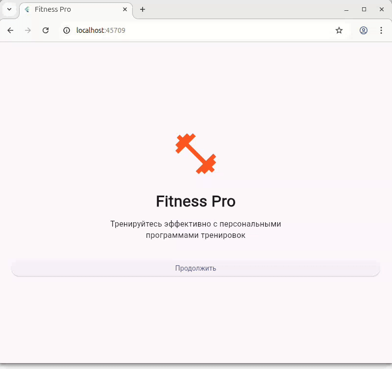

# Инструкция по созданию скриншотов и GIF

Этот файл содержит инструкции для создания демонстрационных материалов приложения.

## 🎥 Создание GIF-демонстрации

### Рекомендуемые инструменты:

**Для записи экрана:**
- **macOS**: QuickTime Player (встроен) или Kap (https://getkap.co/)
- **Windows**: ScreenToGif (https://www.screentogif.com/)
- **Linux**: Peek (https://github.com/phw/peek) или SimpleScreenRecorder

**Для конвертации видео в GIF:**
- **Online**: ezgif.com или cloudconvert.com
- **CLI**: ffmpeg или gifski

### Сценарий записи GIF (30-60 секунд):

1. **Запустить приложение** (должен открыться онбординг)
2. **Онбординг** (2 сек) - показать экран
3. **Клик "Продолжить"** → переход на Paywall
4. **Paywall** (3 сек) - показать два тарифа, выбрать годовой
5. **Клик "Продолжить"** → переход на главный экран
6. **Главный экран** (3 сек) - прокрутить список тренировок
7. **Клик на первую тренировку** → переход к деталям
8. **Детали тренировки** (4 сек) - показать описание, упражнения
9. **Прокрутить вниз** → показать кнопку "Начать тренировку"
10. **Клик кнопки** → показать всплывающее уведомление
11. **Назад** → возврат к списку
12. **Меню (⋮)** → клик
13. **Сбросить подписку** → показать диалог
14. **Подтвердить** → возврат к онбордингу

### Настройки записи:
- **Разрешение**: 1080x1920 (портретная ориентация) или 375x812 (iPhone)
- **FPS**: 30
- **Длительность**: 30-60 секунд
- **Формат**: MP4 → конвертировать в GIF
- **Размер GIF**: не более 10 MB (для GitHub)

## 📸 Создание статичных скриншотов

### Список необходимых скриншотов:

#### 1. `01_onboarding.png`
**Экран онбординга**
- Иконка фитнеса
- Заголовок "Fitness Pro"
- Описание
- Кнопка "Продолжить"

#### 2. `02_paywall.png`
**Экран подписки**
- Заголовок "Получите доступ ко всем тренировкам"
- 4 преимущества подписки
- Два тарифа (месяц выбран)
- Кнопка "Продолжить"

#### 3. `03_home_screen.png`
**Главный экран со списком**
- AppBar с названием "Fitness Pro" и меню
- Список из 10 тренировок
- Видны разные категории и уровни сложности

#### 4. `04_workout_detail.png`
**Детали тренировки**
- Большая иконка категории
- Название тренировки
- 3 информационных карточки
- Описание
- Начало списка упражнений

#### 5. `05_workout_exercises.png`
**Упражнения (прокрутить вниз)**
- Пронумерованный список упражнений
- Кнопка "Начать тренировку"

#### 6. `06_reset_subscription.png`
**Меню сброса подписки**
- Открытое меню с опцией "Сбросить подписку"

### Как сделать скриншоты:

#### Вариант 1: Через Flutter DevTools
```bash
flutter run -d chrome
# Откроется браузер
# Используйте Developer Tools (F12) → Device Toolbar
# Выберите "iPhone 12 Pro" или другое мобильное устройство
# Делайте скриншоты через браузер
```

#### Вариант 2: Android Emulator
```bash
flutter emulators --launch <emulator_id>
flutter run
# Используйте встроенную кнопку скриншота в эмуляторе
```

#### Вариант 3: iOS Simulator (macOS only)
```bash
open -a Simulator
flutter run
# Cmd+S для скриншота
```

### Размеры и форматы:
- **Формат**: PNG (для README)
- **Разрешение**: 375x812 или 390x844 (размеры iPhone)
- **DPI**: 72-144
- **Сжатие**: TinyPNG или ImageOptim для уменьшения размера

## 📁 Структура папки с материалами

После создания материалов, сохраните их:

```
test-flutter/
├── screenshots/
│   ├── 01_onboarding.png
│   ├── 02_paywall.png
│   ├── 03_home_screen.png
│   ├── 04_workout_detail.png
│   ├── 05_workout_exercises.png
│   └── 06_reset_subscription.png
├── demo.gif
└── README.md (обновить с изображениями)
```

## 🎨 Добавление в README

После создания скриншотов, добавьте в README.md:

```markdown
## 📸 Скриншоты

<p float="left">
  
  
  
  
</p>

## 🎥 Демонстрация


```

## 💡 Советы

1. **Чистое состояние**: Перед записью сбросьте подписку через меню
2. **Плавность**: Делайте паузы между действиями (1-2 сек)
3. **Фокус**: Держите курсор вне экрана или используйте touch-режим
4. **Яркость**: Используйте светлую тему (по умолчанию)
5. **Размер**: Оптимизируйте GIF для веба (gifski с качеством 80-90)

## 🚀 Быстрый старт для записи

```bash
# 1. Сбросить состояние (очистить кэш)
flutter clean
flutter pub get

# 2. Запустить в режиме релиза для лучшей производительности
flutter run -d chrome --release

# 3. Начать запись экрана
# 4. Следовать сценарию выше
# 5. Остановить запись
# 6. Конвертировать в GIF (опционально)
```

---

Удачи с созданием демонстрационных материалов! 🎬
